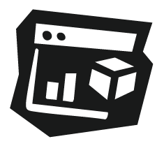

### Hi there, I'm Daniel 👋  
_Data Scientist | PhD in Data Science | Educator | Builder of ML Systems_

> - 🧠 Currently a **Data Scientist**, building production ML tools and analytics platforms for global R&D and manufacturing
> - 🎓 **PhD research** in uncertainty-aware ML, surrogate modelling, and robust optimisation — published 4 papers, presented at 3 international conferences
> - 👥 Taught **10+ courses** and mentored **50+ students** across capstone projects, workshops, and graduate programs
> - 🚀 Built and deployed **8+ full-stack platforms** (Python, dbt, FastAPI, Power BI) used by **350+ global users**
> - 📈 Focused on **scalable ML, simulation, data platforms, and enterprise-ready automation**

### 🔧 Technical Focus

|            | Skills                                                  |
|---------------------|--------------------------------------------------------------|
|         | `Python` · `R` · `Julia` · `SQL` · `TypeScript`                            |
|        | `FastAPI` · `Shiny` · `React` · `Next.js` · `Docker`                      |
|       | `LangChain` · `scikit-learn` · `PyTorch` · `PydanticAI` · `AutoML` · `PyMC3` |
|         | `Databricks` · `Redshift` · `dbt` · `GCP` · `PostgreSQL` · `Neo4j` · `Cypher` |
|        | `Power BI` · `Plotly` · `JMP` · `D3.js`                                   |
|        | `UiPath` · `Power Automate` · `CI/CD`    |

---

<!--### 🧪 Featured Work

---
-->

### 📫 Connect with me

- 🌐 [danielpham.com.au](https://danielpham.com.au)
- 💼 [LinkedIn](https://linkedin.com/in/pham-daniel)
- 🧪 [Google Scholar](https://scholar.google.com.au/citations?user=sV7j3B0AAAAJ)
